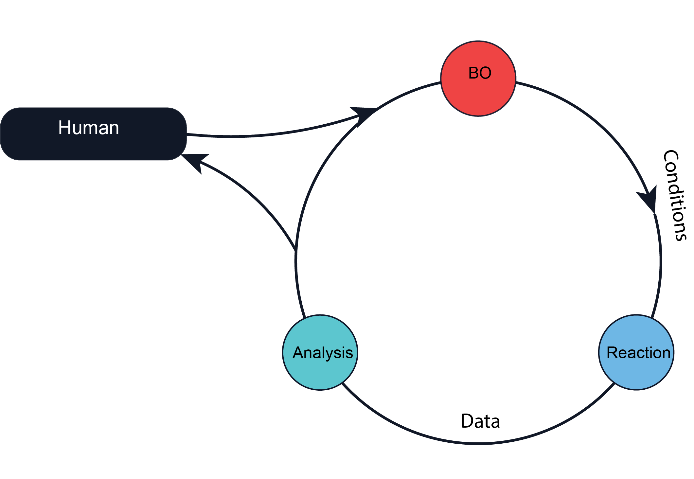
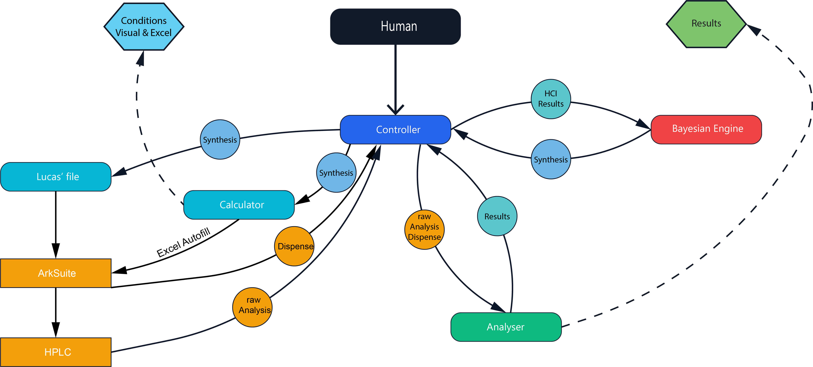

# HTE Dispense Calculator

<p align="center">
  
  
</p>

This repository contains a Python script for calculating reagent and solvent amounts for high-throughput experimentation (HTE) reactions. The script guides the user through entering reagents, specifying dispensing locations on a plate, and calculating masses or volumes required in each well.

In addition to the calculator, the repository includes utilities to check workflows,
analyse reaction outcomes, and a high-level orchestrator that runs the entire
process end-to-end.

## Requirements
- Python 3.8+
- pandas
- numpy
- requests
- openpyxl
- matplotlib
- scipy
- and some others I'm afraid I forgot to list here.

Install dependencies with:

```bash
pip install -r requirements.txt
```

## Quick Start – full automated workflow

<p align="center">
  
</p>

`Workflow.py` ties together calculation, workflow validation,
post‑reaction analysis and Bayesian optimisation.  It applies the naming scheme
`date_experimentname_experimentnumber_content` to every generated file.

```bash
python -m hte_workflow.workflow -- library-path library.json [--BO True/False] [--hci-file hci_file.json]
[--synth-file synth_file.json] [--data-dir custom data directory] [--out-dir custom output directory]
```

The script will:

1. Load the library of reagents from `library.json`.
2. Define an HCI file if not given (chemical space than can be explored).
3. a) Run a bayesian optimisation (BO) loop if `--BO True` is set 
      and generate a synth.json file, or
   b) Manually specify a synth.json file with the desired conditions
4. Run `hte_calculator.py` to visualize the conditions and generate an Excel file
   with the calculated amounts for each well.
5. Call `workflow_checker.py --fill --visualize` to insert the calculated
   volumes into the workflow and create layout images
6. Execute `reaction_analyser.py`, which in turn runs `analysis.py` and
   `dispense_analyser.py`, normalizes yields against the limiting reagent
   and saves heatmaps and pie plots
7. a) Run the next Bayesian loop if `--BO True` is set, or
   b) Return the parsed yield data for further processing

## Library file handling

### Initiate an empy library file
```bash
python -m json_handling.library_and_hci_adapter --init --out name.json --creator "Your name"
--LibraryID "Unique ID" 
```

### Add reagents to the library file
```bash
python -m json_handling.library_and_hci_adapter --add --lib name.json --name "Reagent Name"
--cas "cas number" --mw "molecular weight [g/mol]" --smiles "smiles" --inchi "inchi"
--formula "molecular formula" --swisscatnumber "unique Swiss Cat + ID" --physicalstate "solid, liquid or solution"
[--density "density [g/mL]"] [--concentration "concentration [mol/L"]
```

### List library contents
```bash
python -m json_handling.library_and_hci_adapter --list --lib name.json
```

### Show specific reagent
```bash
python -m json_handling.library_and_hci_adapter --show --lib name.json --name "Reagent Name"
```


## Manual script usage

The tools can also be invoked individually as detailed below.

### Calculator

```bash
python hte_calculator.py [--preload my_reagents.py]
```

The script interactively prompts for reagents and plate layout.  Results are saved
as an Excel file summarizing the amounts for each well.  Supplying `--preload`
loads `PRELOADED_REAGENTS` from the given file before prompting.

During execution you will be asked for a reaction name (used for the Excel/figure
filenames) and the plate format (24, 48, 96 wells or custom layout).  Warnings are shown if any
well lacks solvent or the limiting reagent.  A colour‑coded layout image is also
created for quick visual inspection of reagent distribution.

### Example

```bash
python hte_calculator.py --preload example_reagents.py
```

This writes `actual_<name>.xlsx` which lists the amounts per well.

### Workflow Checker

`workflow_checker.py` compares a workflow Excel file (from Arcsuite) with the output
generated by `hte_calculator.py` and can write the calculated amounts
directly back into the workflow.  Run it with the calculator export and
the **empty** workflow file.  Use `--fill` to modify the workflow in
place before the first orbital shaker step:

```bash
python workflow_checker.py actual.xlsx workflow_empty.xlsx --fill
```

Add `--visualize` to generate plate layout images using `layout_parser.py`:

```bash
python workflow_checker.py actual.xlsx workflow_empty.xlsx --fill --visualize
```

This will call `layout_parser.py` internally to create PNG files showing
the reagent distribution and workflow steps.

### Complete workflow

1. Run `hte_calculator.py` to produce `actual.xlsx`.
2. Fill in the virtual twin in ArcSuite and make sure the product names match the ones
   in `actual.xlsx`.
3. Download the empty workflow file and fill in the product names and reaction conditions.
4. Run `workflow_checker.py actual.xlsx empty.xlsx --fill` to populate the
   workflow file with dispense volumes.
5. (Optional) Re-run with `--visualize` to create layout images for review.

### Reaction analysis

`reaction_analyser.py` combines chromatogram analysis with dispense accuracy
normalization.

```bash
python reaction_analyser.py
```

It will prompt for analysis CSV files and the `actual.xlsx` layout if needed,
then run `analysis.py` and `dispense_analyser.py`, normalizing yields against the
chosen limiting reagent.  Heatmaps and pie charts are written to PNG files and the
normalized data are appended to the analysis workbook.

#### analysis.py

```bash
python analysis.py folder_with_csvs --calibration --visualize --output analysis_output.xlsx
```

`analysis.py` processes raw analysis CSV files.  `--calibration` runs
`calibration.py` first, `--visualize` generates plots and `--layout` can supply
an `actual.xlsx` file for ordering experiments.

#### calibration.py

```bash
python calibration.py folder_with_calibration_csvs
```

Builds calibration curves from dedicated CSV files.

#### dispense_analyser.py

```bash
python dispense_analyser.py RunStatistics.xlsx actual.xlsx --output dispense_analysis.xlsx
```

Creates dispense accuracy statistics and relative differences per well.

### Visualize existing workflow

Use `layout_parser.py` to render layout images from any workflow:

```bash
python layout_parser.py workflow.xlsx
```

